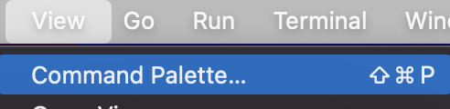
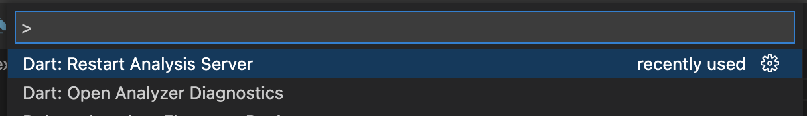

# candies_analyzer_plugin

[](https://pub.dartlang.org/packages/candies_analyzer_plugin) [](https://github.com/fluttercandies/candies_analyzer_plugin/stargazers) [](https://github.com/fluttercandies/candies_analyzer_plugin/network) [](https://github.com/fluttercandies/candies_analyzer_plugin/blob/master/LICENSE) [](https://github.com/fluttercandies/candies_analyzer_plugin/issues) <a target="_blank" href="https://jq.qq.com/?_wv=1027&k=5bcc0gy"></a>

语言: [English](README.md) | 中文简体

## 描述

帮助快速创建自定义 lint 的插件.

- [candies\_analyzer\_plugin](#candies_analyzer_plugin)
  - [描述](#描述)
- [简单使用](#简单使用)
  - [添加引用到 pubspec.yaml](#添加引用到-pubspecyaml)
  - [增加插件到 analysis\_options.yaml](#增加插件到-analysis_optionsyaml)
- [自定义你自己的分析插件](#自定义你自己的分析插件)
  - [模版创建](#模版创建)
  - [增添你的 lint](#增添你的-lint)
    - [启动插件](#启动插件)
    - [创建一个 lint](#创建一个-lint)
      - [dart lint](#dart-lint)
      - [yaml lint](#yaml-lint)
      - [generic lint](#generic-lint)
  - [调试](#调试)
    - [调试错误](#调试错误)
    - [更新代码](#更新代码)
    - [重启 dart analysis 服务](#重启-dart-analysis-服务)
  - [Log](#log)
  - [配置](#配置)
    - [禁止一个 lint](#禁止一个-lint)
    - [包含文件](#包含文件)
    - [自定义 lint 严肃性](#自定义-lint-严肃性)
  - [Default lints](#default-lints)
    - [PerferClassPrefix](#perferclassprefix)
    - [PreferAssetConst](#preferassetconst)
    - [PreferNamedRoutes](#prefernamedroutes)
    - [PerferSafeSetState](#perfersafesetstate)
    - [MustCallSuperDispose](#mustcallsuperdispose)
    - [EndCallSuperDispose](#endcallsuperdispose)
    - [PerferDocComments](#perferdoccomments)
    - [PreferSingleton](#prefersingleton)
    - [GoodDocComments](#gooddoccomments)
    - [PreferTrailingComma](#prefertrailingcomma)
  - [Completion](#completion)
    - [Make a custom completion](#make-a-custom-completion)
    - [扩展方法提示](#扩展方法提示)
  - [Pre-Commit](#pre-commit)
    - [pre\_commit.dart](#pre_commitdart)
    - [pre-commit script](#pre-commit-script)
    - [cacheErrorsIntoFile](#cacheerrorsintofile)
  - [注意事项](#注意事项)
    - [print lag](#print-lag)
    - [pubspec.yaml and analysis\_options.yaml](#pubspecyaml-and-analysis_optionsyaml)
    - [在 vscode 中快速修复只支持 dart 文件.(android studio支持任何文件)](#在-vscode-中快速修复只支持-dart-文件android-studio支持任何文件)
    - [提示自动导入在 vscode 无法完成](#提示自动导入在-vscode-无法完成)

* [example](https://github.com/fluttercandies/candies_analyzer_plugin/example)

* [analyzer_plugin 文档](https://github.com/dart-lang/sdk/blob/master/pkg/analyzer_plugin/doc/tutorial/tutorial.md)

# 简单使用

## 添加引用到 pubspec.yaml

``` yaml
dev_dependencies:
  # zmtzawqlp  
  candies_analyzer_plugin: any
``` 

## 增加插件到 analysis_options.yaml

``` yaml
analyzer:
  # zmtzawqlp  
  plugins:
    candies_analyzer_plugin
``` 

默认的 lints 有如下这些:

* prefer_asset_const
* prefer_named_routes
* prefer_safe_setState
* must_call_super_dispose
* must_call_super_dispose
* perfer_doc_comments
* prefer_singleton
* good_doc_comments
* prefer_trailing_comma

更多的信息可以查看 [Default lints](#Default lints)


# 自定义你自己的分析插件
  
## 模版创建

1. 激活插件

   执行命令 `dart pub global activate candies_analyzer_plugin`


2. 到你的项目的根目录

   假设:
   
   你的项目叫做 `example`
   
   你想创建的插件叫做 `custom_lint`
   
   执行命令 `candies_analyzer_plugin --example custom_lint`, 一个简单插件模板创建成功.

3. 将 `custom_lint` 增加到 根目录 `pubspec.yaml` 的 `dev_dependencies` 中

```yaml
dev_dependencies:
  # zmtzawqlp  
  custom_lint:
    path: custom_lint/
```

4. 将 `custom_lint` 增加到根目录 `analysis_options.yaml` 的 `analyzer plugins` tag 下面

```yaml
analyzer:
  # zmtzawqlp  
  plugins:
    custom_lint
```

当分析结束的时候，在你的 ide 中可以看到一些自定义的 lint 。

## 增添你的 lint

在下面的项目结构下面找到  `plugin.dart`

```
├─ example
│  ├─ custom_lint
│  │  └─ tools
│  │     └─ analyzer_plugin
│  │        ├─ bin
│  │        │  └─ plugin.dart
```

`plugin.dart` 是整个插件的入口。

### 启动插件

我们将在 main 方法中启动我们的插件.

``` dart
CandiesAnalyzerPlugin get plugin => CustomLintPlugin();

// This file must be 'plugin.dart'
void main(List<String> args, SendPort sendPort) {
  CandiesAnalyzerPluginStarter.start(
    args,
    sendPort,
    plugin: plugin,
  );
}

class CustomLintPlugin extends CandiesAnalyzerPlugin {
  @override
  String get name => 'custom_lint';

  @override
  List<String> get fileGlobsToAnalyze => const <String>[
        '**/*.dart',
        '**/*.yaml',
        '**/*.json',
      ];

  @override
  List<DartLint> get dartLints => <DartLint>[
        // add your dart lint here
        PerferCandiesClassPrefix(),
        ...super.dartLints,
      ];

  @override
  List<YamlLint> get yamlLints => <YamlLint>[RemoveDependency(package: 'path')];

  @override
  List<GenericLint> get genericLints => <GenericLint>[RemoveDuplicateValue()];
}
```

### 创建一个 lint

你只需要创一个新的类来继承 `DartLint` ,`YamlLint`, `GenericLint` 即可。


属性: 

| 属性 | 描述  | 默认 |
| --- | --- | --- |
| code | 这个错误的名字，唯一. | 必填 | 
| message | 描述这个错误的信息 | 必填 | 
| url | 这个错误文档的链接. |  | 
| type | 错误的类型. <br/>CHECKED_MODE_COMPILE_TIME_ERROR<br/>COMPILE_TIME_ERROR<br/>HINT<br/>LINT<br/>STATIC_TYPE_WARNING<br/>STATIC_WARNING<br/>SYNTACTIC_ERROR<br/>TODO | 默认为 LINT. | 
| severity | 这个错误的严肃性(一般我们修改的是这个).<br/>INFO<br/>WARNING<br/>ERROR | 默认为 INFO. | 
| correction | 修复这个错误的一些描述. |  | 
| contextMessages | 额外的信息帮助修复这个错误。 |  | 


重要的方法:

| 方法 | 描述  | 重载 |
| --- | --- | --- |
| matchLint | 判断是否是你定义的lint | 必须 | 
| getDartFixes/getYamlFixes/getGenericFixes | 返回快速修复 | getYamlFixes/getGenericFixes 没有效果，保留它以备 dart team 未来某天支持, 查看 [issue](https://github.com/dart-lang/sdk/issues/50306)  | 

#### dart lint

你可以通过重载 [ignoreLint] and [ignoreFile] 方法来忽略某个规则或者某个文件。

下面是一个 dart lint 的例子:

``` dart
class PerferCandiesClassPrefix extends DartLint {
  @override
  String get code => 'perfer_candies_class_prefix';

  @override
  String? get url =>
      'https://github.com/fluttercandies/candies_analyzer_plugin';

  @override
  SyntacticEntity? matchLint(AstNode node) {
    if (node is ClassDeclaration) {
      final String name = node.name2.toString();
      final int startIndex = _getClassNameStartIndex(name);
      if (!name.substring(startIndex).startsWith('Candies')) {
        return node.name2;
      }
    }
    return null;
  }

  @override
  String get message => 'Define a class name start with Candies';

  @override
  Future<List<SourceChange>> getDartFixes(
    DartAnalysisError error,
    CandiesAnalyzerPluginConfig config,
  ) async {
    final ResolvedUnitResult resolvedUnitResult = error.result;

    final Iterable<DartAnalysisError> cacheErrors = config
        .getCacheErrors(resolvedUnitResult.path, code: code)
        .whereType<DartAnalysisError>();

    final Map<DartAnalysisError, Set<SyntacticEntity>> references =
        _findClassReferences(cacheErrors, resolvedUnitResult);

    return <SourceChange>[
      await getDartFix(
        resolvedUnitResult: resolvedUnitResult,
        message: 'Use Candies as a class prefix.',
        buildDartFileEdit: (DartFileEditBuilder dartFileEditBuilder) {
          _fix(
            error,
            resolvedUnitResult,
            dartFileEditBuilder,
            references[error]!,
          );
          dartFileEditBuilder.formatAll(resolvedUnitResult.unit);
        },
      ),
      if (cacheErrors.length > 1)
        await getDartFix(
          resolvedUnitResult: resolvedUnitResult,
          message: 'Use Candies as a class prefix where possible in file.',
          buildDartFileEdit: (DartFileEditBuilder dartFileEditBuilder) {
            for (final DartAnalysisError error in cacheErrors) {
              _fix(
                error,
                resolvedUnitResult,
                dartFileEditBuilder,
                references[error]!,
              );
            }
            dartFileEditBuilder.formatAll(resolvedUnitResult.unit);
          },
        ),
    ];
  }

  void _fix(
    DartAnalysisError error,
    ResolvedUnitResult resolvedUnitResult,
    DartFileEditBuilder dartFileEditBuilder,
    Set<SyntacticEntity> references,
  ) {
    final AstNode astNode = error.astNode;
    // get name node
    final Token nameNode = (astNode as ClassDeclaration).name2;
    final String nameString = nameNode.lexeme;

    final int startIndex = _getClassNameStartIndex(nameString);
    final String replace =
        '${nameString.substring(0, startIndex)}Candies${nameString.substring(startIndex)}';

    for (final SyntacticEntity match in references) {
      dartFileEditBuilder.addSimpleReplacement(
          SourceRange(match.offset, match.length), replace);
    }
  }

  Map<DartAnalysisError, Set<SyntacticEntity>> _findClassReferences(
    Iterable<DartAnalysisError> errors,
    ResolvedUnitResult resolvedUnitResult,
  ) {
    final Map<DartAnalysisError, Set<SyntacticEntity>> references =
        <DartAnalysisError, Set<SyntacticEntity>>{};
    final Map<String, DartAnalysisError> classNames =
        <String, DartAnalysisError>{};

    for (final DartAnalysisError error in errors) {
      classNames[(error.astNode as ClassDeclaration).name2.lexeme] = error;
      references[error] = <SyntacticEntity>{};
    }

    resolvedUnitResult.unit
        .accept(_FindClassReferenceVisitor(references, classNames));

    return references;
  }

  int _getClassNameStartIndex(String nameString) {
    int index = 0;
    while (nameString[index] == '_') {
      index++;
      if (index == nameString.length - 1) {
        break;
      }
    }
    return index;
  }
}

class _FindClassReferenceVisitor extends GeneralizingAstVisitor<void> {
  _FindClassReferenceVisitor(this.references, this.classNames);
  final Map<DartAnalysisError, Set<SyntacticEntity>> references;
  final Map<String, DartAnalysisError> classNames;

  @override
  void visitNode(AstNode node) {
    if (node.childEntities.length == 1) {
      final String source = node.toSource();
      if (classNames.keys.contains(source)) {
        references[classNames[source]]!.add(node);
        return;
      }
    }
    super.visitNode(node);
  }
}
```
#### yaml lint

下面是一个 yaml lint 的例子:

``` dart
class RemoveDependency extends YamlLint {
  RemoveDependency({required this.package});
  final String package;
  @override
  String get code => 'remove_${package}_dependency';

  @override
  String get message => 'don\'t use $package!';

  @override
  String? get correction => 'Remove $package dependency';

  @override
  AnalysisErrorSeverity get severity => AnalysisErrorSeverity.WARNING;

  @override
  Iterable<SourceRange> matchLint(
    YamlNode root,
    String content,
    LineInfo lineInfo,
  ) sync* {
    if (root is YamlMap && root.containsKey(PubspecField.DEPENDENCIES_FIELD)) {
      final YamlNode dependencies =
          root.nodes[PubspecField.DEPENDENCIES_FIELD]!;
      if (dependencies is YamlMap && dependencies.containsKey(package)) {
        final YamlNode get = dependencies.nodes[package]!;
        int start = dependencies.span.start.offset;
        final int end = get.span.start.offset;
        final int index = content.substring(start, end).indexOf('$package: ');
        start += index;
        yield SourceRange(start, get.span.end.offset - start);
      }
    }
  }
}
```

#### generic lint

下面是一个 generic lint 的例子:

``` dart
class RemoveDuplicateValue extends GenericLint {
  @override
  String get code => 'remove_duplicate_value';

  @override
  Iterable<SourceRange> matchLint(
    String content,
    String file,
    LineInfo lineInfo,
  ) sync* {
    if (isFileType(file: file, type: '.json')) {
      final Map<dynamic, dynamic> map =
          jsonDecode(content) as Map<dynamic, dynamic>;

      final Map<dynamic, dynamic> duplicate = <dynamic, dynamic>{};
      final Map<dynamic, dynamic> checkDuplicate = <dynamic, dynamic>{};
      for (final dynamic key in map.keys) {
        final dynamic value = map[key];
        if (checkDuplicate.containsKey(value)) {
          duplicate[key] = value;
          duplicate[checkDuplicate[value]] = value;
        }
        checkDuplicate[value] = key;
      }

      if (duplicate.isNotEmpty) {
        for (final dynamic key in duplicate.keys) {
          final int start = content.indexOf('"$key"');
          final dynamic value = duplicate[key];
          final int end = content.indexOf(
                '"$value"',
                start,
              ) +
              value.toString().length +
              1;

          final int lineNumber = lineInfo.getLocation(end).lineNumber;

          bool hasComma = false;
          int commaIndex = end;
          int commaLineNumber = lineInfo.getLocation(commaIndex).lineNumber;

          while (!hasComma && commaLineNumber == lineNumber) {
            commaIndex++;
            final String char = content[commaIndex];
            hasComma = char == ',';
            commaLineNumber = lineInfo.getLocation(commaIndex).lineNumber;
          }

          yield SourceRange(start, (hasComma ? commaIndex : end) + 1 - start);
        }
      }
    }
  }

  @override
  String get message => 'remove duplicate value';
}
```

## 调试

### 调试错误

在下面的项目结构下面找到  `debug.dart`，已经自动为你创建了 debug 的例子。你可以通过调试来编写符合你条件的 lint

```
├─ example
│  ├─ custom_lint
│  │  └─ tools
│  │     └─ analyzer_plugin
│  │        ├─ bin
│  │        │  └─ debug.dart
```

把 root 修改为你想要调试的项目路径, 默认为 example 的根目录

``` dart
import 'dart:io';
import 'package:analyzer/dart/analysis/analysis_context.dart';
import 'package:analyzer/dart/analysis/analysis_context_collection.dart';
import 'package:analyzer_plugin/protocol/protocol_common.dart';
import 'package:analyzer_plugin/protocol/protocol_generated.dart';
import 'package:candies_analyzer_plugin/candies_analyzer_plugin.dart';
import 'plugin.dart';

Future<void> main(List<String> args) async {
  final String root = Directory.current.parent.parent.parent.path;
  final AnalysisContextCollection collection =
      AnalysisContextCollection(includedPaths: <String>[root]);

  final CandiesAnalyzerPlugin myPlugin = plugin;
  for (final AnalysisContext context in collection.contexts) {
    for (final String file in context.contextRoot.analyzedFiles()) {
      if (!myPlugin.shouldAnalyzeFile(file, context)) {
        continue;
      }

      final bool isAnalyzed = context.contextRoot.isAnalyzed(file);
      if (!isAnalyzed) {
        continue;
      }

      final List<AnalysisError> errors =
          (await myPlugin.getAnalysisErrorsForDebug(
        file,
        context,
      ))
              .toList();
      for (final AnalysisError error in errors) {
        final List<AnalysisErrorFixes> fixes = await myPlugin
            .getAnalysisErrorFixesForDebug(
                EditGetFixesParams(file, error.location.offset), context)
            .toList();
        print(fixes.length);
      }

      print(errors.length);
    }
  }
}
```

### 更新代码

```
├─ example
│  ├─ custom_lint
│  │  └─ tools
│  │     └─ analyzer_plugin
```

你有2种方式更新代码到 dartServer。


1. 删除 .plugin_manager 文件夹

注意, `analyzer_plugin` 文件夹下面的东西会复制到 `.plugin_manager` 下面，根据插件的路径加密生成对应的文件夹。

macos:  `/Users/user_name/.dartServer/.plugin_manager/`

windows: `C:\Users\user_name\AppData\Local\.dartServer\.plugin_manager\`

如果你的代码改变了, 请删除掉 `.plugin_manager` 下面的文件

或者通过执行 `candies_analyzer_plugin --clear-cache` 来删除 `.plugin_manager` 下面的文件. 


1. 把新的代码写到 custom_lint 下面

你可以把新代码写到 custom_lint 下面, 比如在 custom_lint.dart. 

```
├─ example
│  ├─ custom_lint
│  │  ├─ lib
│  │  │  └─ custom_lint.dart
```

如果这样的话，你必须增加 `custom_lint` 引用到 `analyzer_plugin\pubspec.yaml` 当中

你必须使用 `绝对路径`，因为 analyzer_plugin 文件夹是会被复制到 `.plugin_manager` 下面的.

如果你不是要发布一个新的 package 的话，我不建议你使用第2种方式。


```
├─ example
│  ├─ custom_lint
│  │  ├─ lib
│  │  │  └─ custom_lint.dart
│  │  └─ tools
│  │     └─ analyzer_plugin
│  │        ├─ analysis_options.yaml
```

``` yaml
dependencies:
  custom_lint: 
    # absolute path  
    path: xxx/xxx/custom_lint
  candies_analyzer_plugin: any
  path: any
  analyzer: any
  analyzer_plugin: any
```

### 重启 dart analysis 服务

更新完毕代码之后，你可以通过在 vscode 中，通过下面的方式重启服务。

1. 在 `View` 下面找到 `Command Palette`



2. 输入 `Restart Analysis Server`




分析结束之后，你可以看到最新的结果.

## Log

在被分析的项目根目录会生成  `custom_lint.log`，用于查看分析过程的信息。

1. 为了性能，默认是关闭的，你可以打开. 

   `CandiesAnalyzerPluginLogger().shouldLog = true;`

2. 你可以更改日志的名字 

   `CandiesAnalyzerPluginLogger().logFileName = 'your name';`

3. 记录信息
   
``` dart
   CandiesAnalyzerPluginLogger().log(
        'info',
        // which location custom_lint.log will be generated
        root: result.root,
      );
```

4. 记录错误

``` dart
   CandiesAnalyzerPluginLogger().logError(
     'analyze file failed:',
     root: analysisContext.root,
     error: e,
     stackTrace: stackTrace,
   );
```

## 配置

### 禁止一个 lint

编写的自定义 lints 默认是全部开启的。当然你可以通过在 analysis_options.yaml 增加配置来禁用它。

1. 使用 ignore tag 来禁用.

``` yaml
analyzer:
  errors:
    perfer_candies_class_prefix: ignore
```

2. 使用 exclude 来过滤掉不想分析的文件
  
``` yaml
analyzer:
  exclude:
    - lib/exclude/*.dart
```

3. 通过将某个lint 设置为 false

``` yaml
linter:
  rules:
    # disable a lint
    perfer_candies_class_prefix: false 
```

### 包含文件

我们可以通过在 `custom_lint`(你定义的插件名字) 下面的 `include` 标记下面增加包含的文件。
如果我们做了这个设置，那么我们就只会分析这些文件。

``` yaml

# your plugin name
custom_lint:
  # if we define this, we only analyze include files
  include: 
    - lib/include/*.dart
```

### 自定义 lint 严肃性

你可以设置某个 lint 的严肃性。

比如 `perfer_candies_class_prefix` 把它的严肃性从 `info` 改为 `warning`.

支持 `warning` , `info` , `error`.

``` yaml
analyzer:
  errors:
    # override error severity
    perfer_candies_class_prefix: warning
```

## Default lints

### PerferClassPrefix

全部的类已某个前缀开始

``` dart
class PerferClassPrefix extends DartLint {
  PerferClassPrefix(this.prefix);

  final String prefix;

  @override
  String get code => 'perfer_${prefix}_class_prefix';
}
```

### PreferAssetConst

asset 资源使用不要直接写字符串，而应该使用定义好的 const

``` dart
class PreferAssetConst extends DartLint {
  @override
  String get code => 'prefer_asset_const';
  @override
  String? get url => 'https://pub.flutter-io.cn/packages/assets_generator';    
}
```
### PreferNamedRoutes

推荐使用命名路由

``` dart
class PreferNamedRoutes extends DartLint {
  @override
  String get code => 'prefer_named_routes';
  @override
  String? get url => 'https://pub.flutter-io.cn/packages/ff_annotation_route';    
}
```

### PerferSafeSetState

在使用 `setState` 之前请先检查 `mounted`

``` dart
class PerferSafeSetState extends DartLint {
  @override
  String get code => 'prefer_safe_setState';
}
```

### MustCallSuperDispose

此方法的实现应以调用继承的方法结束

``` dart
class MustCallSuperDispose extends DartLint with CallSuperDisposeMixin {
  @override
  String get code => 'must_call_super_dispose';
}
```

### EndCallSuperDispose

应该在方法的最后才调用 `super.dispose()` 

``` dart
class EndCallSuperDispose extends DartLint with CallSuperDisposeMixin {
  @override
  String get code => 'end_call_super_dispose';
}
```

### PerferDocComments

https://dart.dev/guides/language/effective-dart/documentation
跟 `public_member_api_docs` 一致，但是我们提供了 [ignoreLint] and [ignoreFile] 来过滤结果，你也可以重载
[isPrivate] and [inPrivateMember] 来检查私有成员。


``` dart
class PerferDocComments extends DartLint {
  @override
  String get code => 'perfer_doc_comments';
}
```

### PreferSingleton

这不是一个单例，但是每次都被创建使用。
 
``` dart
class PreferSingleton extends DartLint {
  @override
  String get code => 'prefer_singleton';
}
```

### GoodDocComments

错误的注释格式。公共 api 使用 (/// xxx)， 其他情况使用 (// xxx)。
 
``` dart
class GoodDocComments extends DartLint {
  @override
  String get code => 'good_doc_comments';
}
```

### PreferTrailingComma

为了更好的代码格式，在结尾增加逗号。
 
``` dart
class PreferTrailingComma extends DartLint {
  @override
  String get code => 'prefer_trailing_comma';
}
```

## Completion

### Make a custom completion

你可以定义自己的 `CompletionContributor` , `ExtensionMemberContributor` 是默认自带的.

``` dart
  /// The completionContributors to finish CompletionRequest
  List<CompletionContributor> get completionContributors =>
      <CompletionContributor>[
        ExtensionMemberContributor(),
      ];
``` 

### 扩展方法提示

虽然官方已经关闭了这个问题 [Auto import (or quickfix?) for Extensions · Issue #38894 · dart-lang/sdk (github.com)](https://github.com/dart-lang/sdk/issues/38894) , 但是在不同的编辑器中依然有很多问题。

`ExtensionMemberContributor` 帮助更好的处理扩展.

## Pre-Commit

### pre_commit.dart

在下面的项目结构下面找到  `pre_commit.dart`  , 它是一个在提交代码前检查错误的例子

```
├─ example
│  ├─ custom_lint
│  │  └─ tools
│  │     └─ analyzer_plugin
│  │        ├─ bin
│  │        │  └─ pre_commit.dart
```
### pre-commit script

执行 `candies_analyzer_plugin --pre-commit`, pre-commit 脚本将被生成到 .git/hooks 中

你可以通过增加以下文件，来自定这个脚本内容。

```
├─ example
│  ├─ pre-commit
```

其中 {0} and {1} 是占位符，请勿修改.

```
#!/bin/sh

# project path
base_dir="{0}"

dart format "$base_dir"

# pre_commit.dart path
pre_commit="{1}"
 
echo "Checking the code before submit..."
echo "Analyzing $base_dir..."

info=$(dart "$pre_commit" "$base_dir")

echo "$info"

if [[ -n $info && $info != *"No issues found"* ]];then
exit 1
fi
```

当前通过 `git commit` 命令提交代码的时候, 会先执行 .git/hooks/pre-commit 脚本.
而这个脚本会去调用 `example/custom_lint/tools/analyzer_plugin/bin/pre_commit.dart`, 如果有错误的话，请调用 exit 1。

所以你可以通过修改 `example/pre-commit` 和 `example/custom_lint/tools/analyzer_plugin/bin/pre_commit.dart`  来定义你自己的检查规则。

### cacheErrorsIntoFile

将 `CandiesAnalyzerPlugin.cacheErrorsIntoFile` 为 true, 来减少提交代码之前检查错误的时间。

## 注意事项 
### print lag

不要在插件的分析代码中使用 `print` ，这会导致 analysis 卡顿

### pubspec.yaml and analysis_options.yaml

只有当你在 `pubspec.yaml` 和 `analysis_options.yaml` 中添加了 `custom_lint`，分析才会进行
   
1. 将 `custom_lint` 添加到  `pubspec.yaml` 中的 `dev_dependencies`  , 查看 [pubspec.yaml](https://github.com/fluttercandies/candies_analyzer_plugin/example/pubspec.yaml)
   
2. 将 `custom_lint` 添加到 `analysis_options.yaml` 中的 `analyzer` `plugins` ，查看 [analysis_options.yaml](https://github.com/fluttercandies/candies_analyzer_plugin/example/analysis_options.yaml)


### 在 vscode 中快速修复只支持 dart 文件.(android studio支持任何文件)

[issue](https://github.com/dart-lang/sdk/issues/50306)

### 提示自动导入在 vscode 无法完成

[issue](https://github.com/dart-lang/sdk/issues/50449)
